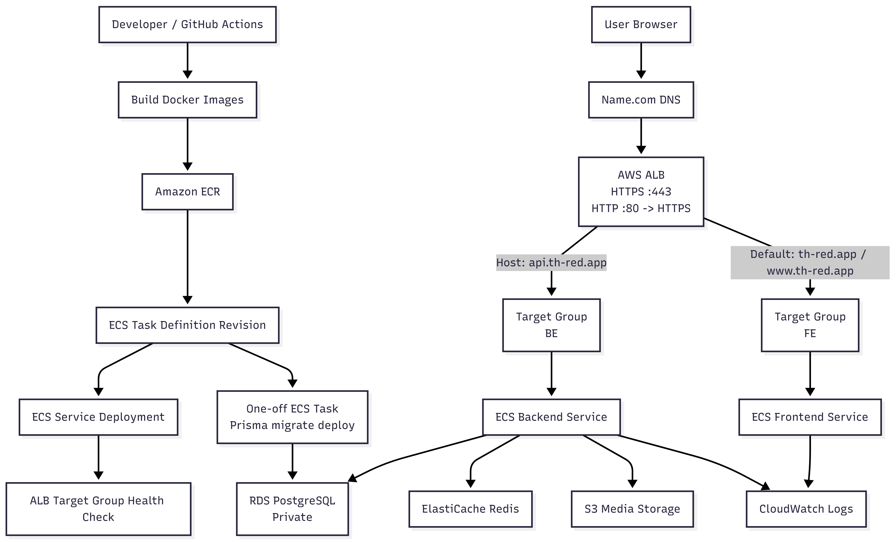

# Konekt

Konekt is a full-stack social networking app built with Next.js and NestJS. It includes posts, replies, likes, reposts, bookmarks, follows, lists, search, personalized feeds, real-time chat, notifications, moderation, admin tooling, and account-security flows.

## Architecture

```text
Browser
  |
  |-- Next.js frontend (social-fe :3000)
  |       | HTTP + Socket.IO
  |       | shared TypeScript contracts
  |       v
  |-- @social/api-contracts (packages/api-contracts)
  |       ^
  |       | shared TypeScript contracts
  |       |
  `-- NestJS API (social-be :8000)
          |-- PostgreSQL / Prisma  - application data
          |-- Redis / BullMQ       - cache, OTPs, queues, rate limiting
          |-- Socket.IO            - chat and notifications
          `-- S3-compatible store  - media uploads
```

## Tech Stack

| Area | Technologies |
| --- | --- |
| Frontend | Next.js 16, React 19, TypeScript, Tailwind CSS, TanStack Query, Zustand, Socket.IO client |
| Backend | NestJS 11, TypeScript, Prisma, Socket.IO, BullMQ, Swagger |
| Shared | Workspace package `@social/api-contracts` for FE/BE API request and response types |
| Data | PostgreSQL 15, Redis |
| Infrastructure | Docker Compose, Nginx, GitHub Actions, Terraform, AWS ECS/Fargate, ALB, RDS, ElastiCache, S3 |

## Repository Structure

```text
.
|-- package.json              # Workspace root and shared scripts
|-- packages/
|   `-- api-contracts/        # Shared FE/BE API contracts
|-- social-fe/                # Next.js web app
|-- social-be/                # NestJS API, Prisma schema, queues, gateways
|-- infra/                    # Terraform environments
|-- assets/                   # Documentation assets
|-- docker-compose.yml        # Production-style stack using published images
`-- nginx.conf                # Reverse proxy configuration
```

## API Contract Boundary

Shared API types live in `packages/api-contracts/src` and are imported as `@social/api-contracts`.

Backend modules keep DTOs behind explicit boundaries:

```text
social-be/src/modules/<module>/dto/
|-- requests/   # class-validator request DTOs used by controllers
|-- responses/  # response DTOs or type re-exports from @social/api-contracts
`-- shared/     # module-local DTO pieces, only when needed
```

Frontend API-facing interfaces should re-export or compose types from `@social/api-contracts`. UI-only types can remain local to the frontend.

After changing contracts, run:

```bash
npm run build:contracts
cd social-be && npm run build
cd ../social-fe && ./node_modules/.bin/tsc -p tsconfig.json --noEmit
```

## Local Development

### 1. Install dependencies

Install backend and frontend dependencies from their own lockfiles:

```bash
cd social-be && npm ci
cd ../social-fe && npm ci
```

The shared contract package uses the backend TypeScript compiler, so install `social-be` dependencies before running `npm run build:contracts` from the repository root.

### 2. Configure the backend

```bash
cp social-be/.env.example social-be/.env
```

Update local secrets and optional mail, OAuth, Redis, and object-storage values. Do not commit `.env` files.

### 3. Start PostgreSQL and Redis

```bash
cd social-be
docker compose up -d db redis
```

PostgreSQL is exposed on `localhost:5432`; Redis is exposed on `localhost:6380`.

### 4. Run migrations

```bash
cd social-be
npx prisma migrate deploy
```

For local schema development, use `npx prisma migrate dev`. To inspect data, use `npx prisma studio`.

### 5. Run the apps

Create `social-fe/.env.development` if needed:

```env
NEXT_PUBLIC_API_URL=http://localhost:8000/api/v1
NEXT_PUBLIC_SERVER_URL=http://localhost:8000
```

Start each app in a separate terminal:

```bash
cd social-be && npm run start:dev
cd social-fe && npm run dev
```

Open `http://localhost:3000`. The API is available at `http://localhost:8000/api/v1`; Swagger is available at `http://localhost:8000/api/docs` outside production.

## Docker

Run the backend development stack:

```bash
cd social-be
docker compose up --build
```

Run the root production-style stack with published images:

```bash
docker compose up -d
```

The root stack expects a root `.env` with deployment variables such as `GITHUB_SHA`, `POSTGRES_USER`, `POSTGRES_PASSWORD`, `POSTGRES_DB`, `REDIS_PASSWORD`, JWT secrets, and `NEXT_PUBLIC_*` URLs.

PostgreSQL credentials are applied only when the named Docker volume is created. If local credentials changed and local data can be discarded, recreate the volumes:

```bash
cd social-be
docker compose down -v
docker compose up --build
```

## Useful Commands

| Scope | Command |
| --- | --- |
| Shared contracts build | `npm run build:contracts` |
| Backend dev | `cd social-be && npm run start:dev` |
| Backend build | `cd social-be && npm run build` |
| Backend tests | `cd social-be && npm test` |
| Backend E2E tests | `cd social-be && npm run test:e2e` |
| Backend lint | `cd social-be && npm run lint` |
| Frontend dev | `cd social-fe && npm run dev` |
| Frontend build | `cd social-fe && npm run build` |
| Frontend lint | `cd social-fe && npm run lint` |
| Frontend typecheck | `cd social-fe && ./node_modules/.bin/tsc -p tsconfig.json --noEmit` |
| Prisma Studio | `cd social-be && npx prisma studio` |

## Deployment



Terraform environments live under `infra/envs`:

- `infra/envs/staging` provisions a Docker-based staging environment.
- `infra/envs/production` provisions the AWS ECS/Fargate deployment path.

See the environment-specific README files for Terraform inputs and deployment details.

## Verification Before PR

```bash
npm run build:contracts
cd social-be && npm run build && npm test
cd ../social-fe && npm run lint && npm run build
```
